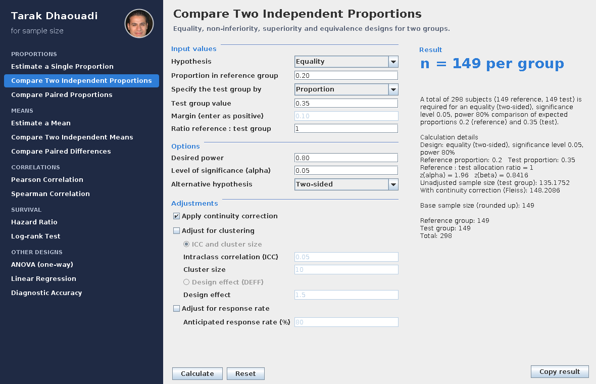

# Tarak Dhaouadi for Sample Size

[](https://github.com/tarak-dhaouadi/sample-size-calculator/actions/workflows/check.yaml)
[](LICENSE.md)


A free desktop application for **sample-size calculation** in common biomedical and
epidemiological study designs. It is written in plain Java (Swing) with **no external dependencies**,
runs on Windows, macOS and Linux, and shows the formula inputs and every intermediate step next to
each result.



## Calculators

| Group | Calculators |
|---|---|
| **Proportions** | Estimate a single proportion · Compare two independent proportions · Compare paired proportions |
| **Means** | Estimate a mean · Compare two independent means · Compare paired differences |
| **Correlations** | Pearson correlation · Spearman correlation |
| **Survival** | Hazard ratio · Log-rank test |
| **Other designs** | One-way ANOVA · Linear regression · Diagnostic accuracy (sensitivity / specificity) |

Two-group comparisons support equality, non-inferiority, superiority and equivalence designs and any
allocation ratio. Optional adjustments: continuity correction, finite population, clustering (ICC or design
effect), response rate and t-distribution.

The calculators for proportions and means follow the methods documented on the help pages of
[Statulator](https://statulator.com). This is an independent implementation and is not affiliated with
Statulator.

## Installation

1. Install **Java 8 or newer** (an OpenJDK build such as [Temurin](https://adoptium.net) is recommended: it
   scales the window correctly on high-resolution screens).
2. Download `TarakDhaouadiSampleSize.jar` from the [Releases](../../releases) page.
3. Double-click the JAR, or run:

   ```
   java -jar TarakDhaouadiSampleSize.jar
   ```

## Building from source

You need a JDK (8 or newer) on your `PATH`.

```bash
./build.sh          # Linux / macOS   ->  dist/TarakDhaouadiSampleSize.jar
build.bat           # Windows         ->  dist\TarakDhaouadiSampleSize.jar
```

Add `test` (`./build.sh test` or `build.bat test`) to run the test suites after building.
On Windows, `run.bat` starts the JAR built in `dist\`.

### Project layout

```
.github/workflows/    continuous integration (check.yaml) and release (release.yaml)
docs/                 METHODS.md (formulas, assumptions, validation) and the screenshot
src/main/java/...     Calc.java (formulas) · Stats.java (distributions) · SampleSizeApp.java (user interface)
src/main/resources/   photo.jpg shown in the application header
src/test/java/...     CalcTest.java (numerical tests) · ModulesSmokeTest.java (every calculator panel)
build.sh, build.bat   build scripts (output in build/ and dist/, both ignored by Git)
```

## Statistical methods and validation

[`docs/METHODS.md`](docs/METHODS.md) states the formula, the assumptions and the references for every calculator.
The test suite checks the distribution functions against standard tables and the sample sizes against
published examples (Statulator help pages, G\*Power, textbook values), verifies properties that must always
hold, and feeds thousands of random inputs to the engine and to every calculator panel to make sure invalid
input is reported with a message rather than a crash. The same checks run on every push, on Linux and Windows
and with Java 8, 11, 17 and 21, through GitHub Actions.

## Limitations

Sample-size results depend on the assumptions you enter. Most formulas are large-sample approximations
(see [`docs/METHODS.md`](docs/METHODS.md)). Please have the final calculation checked by a statistician before
using it in a protocol or grant application.

## Citation

If you use this software, please cite it using the "Cite this repository" button on GitHub
(from [`CITATION.cff`](CITATION.cff)).

## License

The source code is released under the [MIT License](LICENSE.md). The profile photo
`src/main/resources/photo.jpg` is © Tarak Dhaouadi and is **not** covered by the MIT License.
